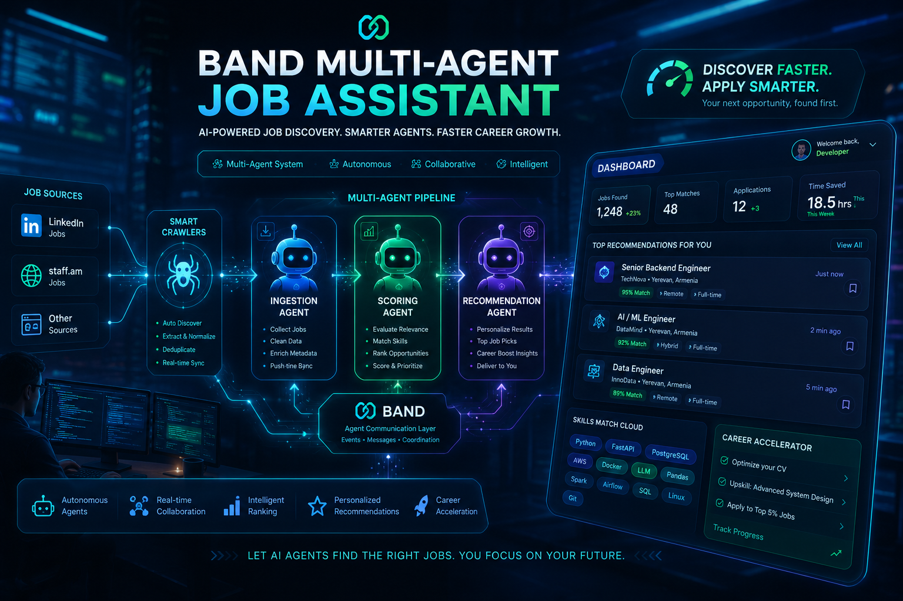
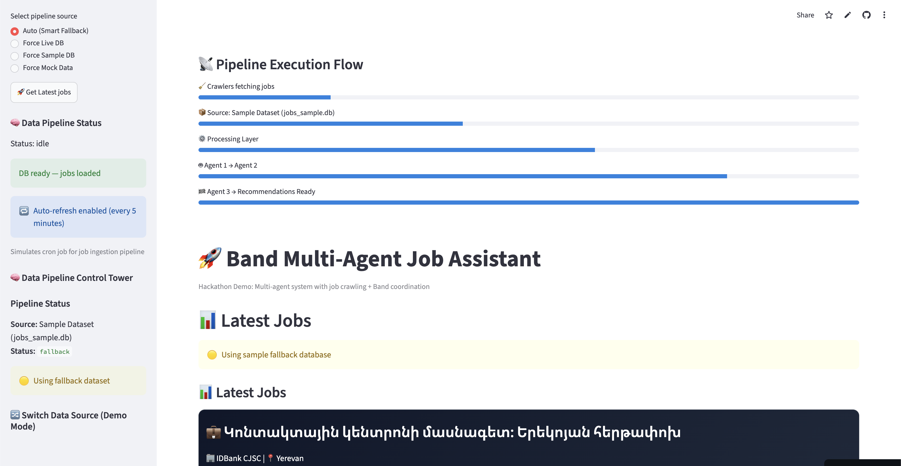
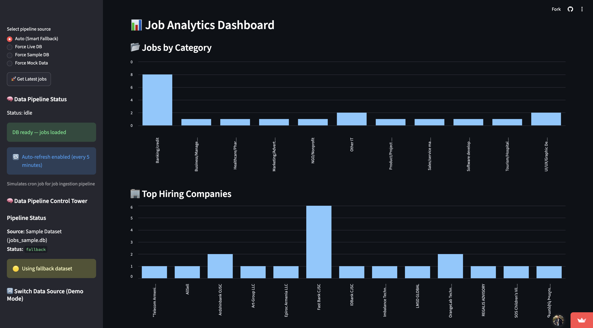
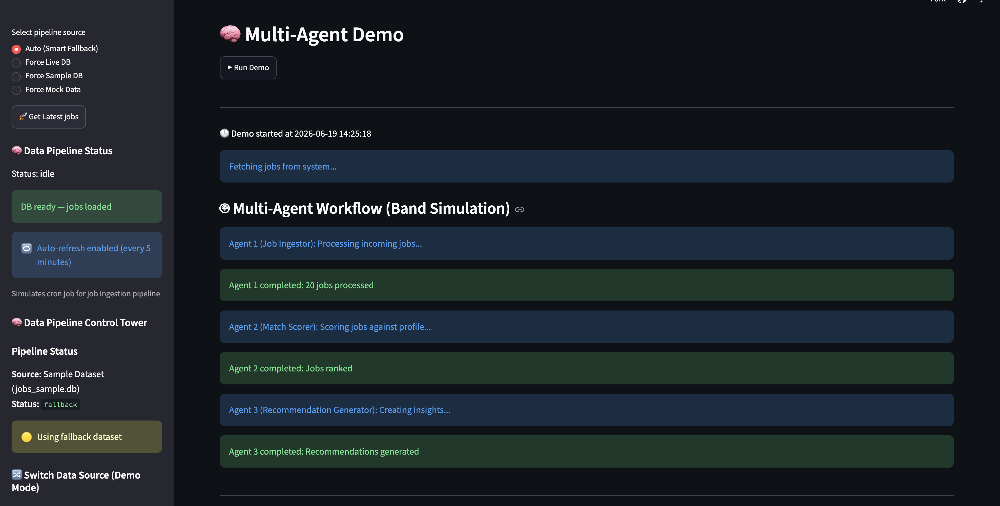
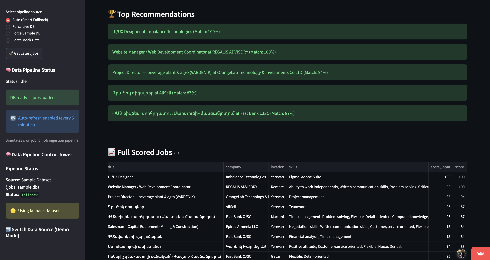
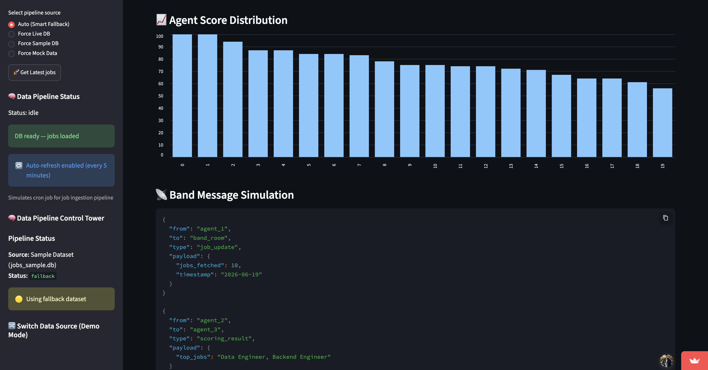

# AI Recruitment Platform with Band.ai



An AI-powered recruitment ecosystem built on **Band.ai**, consisting of three specialized agents that collaborate to streamline the hiring and job application process.

## Overview

This project provides an end-to-end recruitment workflow using multiple AI agents:

1. **Recruitment Research Agent** – Analyzes resumes, extracts structured candidate profiles, performs job matching, and researches companies and candidates.
2. **Job Hunter Agent** – Searches a curated jobs database and identifies the most relevant opportunities based on skills, experience, or an extracted CV profile.
3. **Cover Letter Writer Agent** – Generates personalized cover letters and recruiter outreach messages tailored to specific job opportunities.

Together, these agents automate candidate analysis, job discovery, and application material generation.

---

## Quick Start

* **Prereqs**: Python 3.8+ and git.
* **Virtualenv**: Create and activate the environment:
    ```bash
    python3 -m venv .venv
    source .venv/bin/activate
    ```
* **Install deps**:
    ```bash
    pip install -r requirements.txt
    ```

---

## Database

* **Path**: `data/jobs.db` — created and updated automatically by the crawlers. No manual setup required.
* **Tables**:
    * `linkedin` — populated by `backend/crawler/linkedin.py`
    * `staff_am` — populated by `backend/crawler/staff_am.py`

**Inspect the database:**
```bash
sqlite3 data/jobs.db "SELECT count(*) FROM linkedin;"
sqlite3 data/jobs.db "SELECT count(*) FROM staff_am;"
```

---

## Running Crawlers Manually

### LinkedIn Crawler

* **File**: `backend/crawler/linkedin.py`

**Basic usage:**
```bash
python backend/crawler/linkedin.py \
  --keywords "Data Engineer" \
  --location "Armenia" \
  --date-posted week \
  --max-pages 2 \
  --delay 0.5
```

**Single page, verbose example:**
```bash
python backend/crawler/linkedin.py \
  --keywords "Backend Engineer" \
  --location "Yerevan, Armenia" \
  --date-posted day \
  --max-pages 1 \
  --delay 1.0 \
  --verbose
```

**Flags:**

| Flag | Description |
|------|-------------|
| `--keywords` | Search query (required) |
| `--location` | Text location (e.g., `"Armenia"` or `"Yerevan, Armenia"`); the script may map known locations to a LinkedIn `geoId` |
| `--date-posted` | `day` \| `week` \| `month` \| `any` |
| `--max-pages` | Number of result pages to fetch |
| `--delay` | Seconds to wait between requests (reduces rate-limiting) |
| `--verbose` | Enable additional logging (if implemented) |

**Note on location accuracy:** LinkedIn may return listings outside the exact text passed to `--location`. For better targeting, `linkedin.py` uses known `geoId` mappings (see `GEO_ID_MAP` in the file) and may also post-filter parsed results by location — which can reduce the number of saved results when LinkedIn returns loosely-labeled cards.

Results are saved to `jobs.db` (table `linkedin`).

### staff.am Crawler

* **File**: `backend/crawler/staff_am.py`

**Basic usage:**
```bash
python backend/crawler/staff_am.py \
  --max-pages 5 \
  --delay 0.5
```

Results are saved to `jobs.db` (table `staff_am`).

---

## Automated Hourly Runner

`scripts/run_crawlers.sh` runs both crawlers on a schedule and writes logs to `data/logs/`. It uses a lock file to prevent overlapping runs and expects a virtualenv at `.venv` (edit the `PY` variable in the script if you use a different Python).

**Make it executable:**
```bash
chmod +x scripts/run_crawlers.sh
```

**Run immediately** (for testing, with console output):
```bash
./scripts/run_crawlers.sh
```

**Schedule hourly with cron** (runs at minute 0 every hour):
```bash
crontab -e
```
Add the line:
```
0 * * * * /full/path/to/band-of-agents-hackathon/scripts/run_crawlers.sh
```

**View logs live:**
```bash
tail -F data/logs/linkedin-*.log data/logs/staff_am-*.log
```

**Notes:**
* The crawlers update `jobs.db` automatically on every run — no manual DB steps required. Use manual runs (above) only for testing or debugging.
* The lock file prevents concurrent runs. Removing this logic to allow overlapping runs is not recommended.
* Logs are timestamped per run (UTC).

---

## Troubleshooting

* **Few or no results for a `--location`**: Try a broader location string, or check `GEO_ID_MAP` in `linkedin.py` for a known-good mapping.
* **Request failures**: Confirm network access is stable and that all dependencies (`requests`, `beautifulsoup4`, `lxml`, `fake-useragent`) are installed in your active virtual environment.

---


# AI Recruitment Architecture

```text
Candidate Resume
       │
       ▼
Recruitment Research Agent
       │
       ├── Extract Candidate Profile
       ├── Resume Analysis
       └── Job Matching
       │
       ▼
Job Hunter Agent
       │
       ├── Search Jobs by Skills
       ├── Search Jobs by Experience
       └── Recommend Relevant Opportunities
       │
       ▼
Cover Letter Writer Agent
       │
       ├── Generate Cover Letter
       └── Generate Recruiter Message
       │
       ▼
Application Package
```

---

# Agents

## 1. Recruitment Research Agent

### Purpose

Analyze candidate resumes and extract structured information that can be used throughout the recruitment workflow.

### Band.ai name and description

Agent name: recruitment-research-agent

Description: Recruitment Research Agent is an AI-powered assistant that combines resume analysis, job matching, document intelligence, and web research. It can parse CVs pasted in chat or extracted from PDFs and Google Drive links, build structured candidate profiles, evaluate candidates against job descriptions, identify skill gaps, and provide hiring recommendations. It can search the web, analyze webpages, and gather additional candidate or company insights to support data-driven recruitment decisions.


### Capabilities

* Parse resumes pasted directly into chat
* Extract structured candidate profiles
* Analyze skills and experience
* Match resumes against job descriptions
* Identify missing skills
* Generate hiring recommendations
* Read PDF resumes from URLs
* Research candidates and companies

### Input Examples

#### Resume Analysis

```text
Analyze the following resume:

[resume text]
```

#### Job Matching

```text
Match this resume against the following job description:

Resume:
[resume]

Job:
[job description]
```

### Output

```json
{
  "skills": [
    "Python",
    "Machine Learning",
    "SQL"
  ],
  "experience": [...],
  "education": [...],
  "recommendation": "Strong Match"
}
```

---

## 2. Job Hunter Agent

### Purpose

Find and recommend jobs from the internal jobs database.


### Band.ai name and description

Agent name:job-hunter

Description: Job Hunter is an AI-powered job discovery assistant that searches a curated jobs database and identifies the most relevant opportunities based on a candidate’s skills, experience, and career goals. It can match jobs against an extracted CV profile, rank opportunities by relevance, highlight matching skills, and recommend positions that best fit the candidate’s background.

### Data Source

The agent uses a local SQLite database:

```text
data/jobs.db
```

Table:

```text
staff_am
```

Only active (non-expired) jobs are returned.

### Capabilities

* Search jobs by skills
* Search jobs by keywords
* Match jobs to candidate profiles
* Rank opportunities by relevance
* Return latest active jobs
* Support requests from users and other agents

### Input Examples

#### Search by Skills

```text
Find jobs requiring:

Python
Computer Vision
PyTorch
```

#### Search by Candidate Profile

```text
Find jobs for this candidate:

{
  "skills": [
    "Python",
    "Machine Learning",
    "Computer Vision"
  ]
}
```

### Output Example

```json
[
  {
    "title": "Computer Vision Engineer",
    "company": "ABC Company",
    "match_score": 92
  },
  {
    "title": "AI Research Engineer",
    "company": "XYZ Company",
    "match_score": 88
  }
]
```

---

## 3. Cover Letter Writer Agent

### Purpose

Generate professional job application materials.

### Band.ai name and description

Agent name:cover-letter-writer

Description: Cover Letter Writer is an AI-powered application assistant that creates personalized cover letters and recruiter outreach messages tailored to specific job opportunities. Using a candidate’s resume, profile, and job description, it highlights relevant skills, achievements, and experience to produce professional application materials that improve the chances of securing interviews and building meaningful recruiter connections.

### Capabilities

* Create personalized cover letters
* Create recruiter outreach messages
* Tailor content to specific job descriptions
* Highlight relevant skills and achievements
* Generate complete application packages

### Input Example

```text
Candidate Information:

[profile or resume]

Job Description:

[job description]
```

### Outputs

#### Cover Letter

Professional application letter customized to the role.

#### Recruiter Message

Short outreach message for LinkedIn or email.

Example:

```text
Hello,

I recently came across your opening for a Computer Vision Engineer and was excited by the opportunity. With experience in Python, deep learning, and computer vision research, I believe my background aligns well with your team's needs.

I would welcome the opportunity to discuss how I can contribute.

Best regards,
Mohammad
```

---

# Multi-Agent Workflow

## Scenario : Candidate Looking for Jobs

### Step 1

Recruitment Research Agent extracts the profile.

```text
Resume
→ Structured Candidate Profile
```

### Step 2

Job Hunter Agent finds matching jobs.

---

## Demo & Media

Demo assets are included in the repository under the `demo/` folder:

- `demo/demo.pdf` — walkthrough and feature summary (PDF)
- `demo/demo.mp4` — short demo video showcasing the app (MP4)
- `demo/images/` — project screenshots used in the Streamlit UI (PNG / JPG)
- `demo/images/cover.png` — cover image used on the demo page

You can preview or download these files directly from the repository.

**Live demo (deployed):**

https://amir-zarecom-ux7nnec4bzvfaigmwynxf2.streamlit.app/

---

### Screenshots

Preview screenshots from the app (click to view full-size in the repo):







```text
Candidate Profile
→ Top Matching Jobs
```

### Step 3

Cover Letter Writer Agent generates application materials.

```text
Candidate Profile + Selected Job
→ Cover Letter + Recruiter Message
```


---


# Environment Variables

Create a `.env` file:

```env
ML_API_KEY=YOUR_KEY

BAND_WS_URL=YOUR_BAND_WS_URL
BAND_REST_URL=YOUR_BAND_REST_URL
```

---

# Running Agents

## Recruitment Research Agent

```bash
python backend\agents\recruitment-research-agent.py
```

---

## Job Hunter Agent

```bash

python backend\agents\job_hunter_agent.py
```

---

## Cover Letter Writer Agent

```bash
python backend\agents\cover-letter-agent.py
```

## Run all agents together

```bash
script.bat
```

---

# Example End-to-End Workflow

### User

```text
Analyze my resume and find Computer Vision jobs.
```

### Recruitment Research Agent

```text
Extracted Skills:
- Python
- OpenCV
- PyTorch
- Deep Learning
```

### Job Hunter Agent

```text
Top Matches:
1. Computer Vision Engineer
2. AI Research Engineer
3. Machine Learning Engineer
```

### User

```text
Generate a cover letter for Job #1.
```

### Cover Letter Writer Agent

```text
Professional Cover Letter
+
Recruiter Outreach Message
```

---

# Technology Stack

* Band.ai
* LangGraph
* LangChain
* DeepSeek V4 Pro
* SQLite
* Python
* Pydantic

---

# Benefits

* Automated resume analysis
* Intelligent job recommendations
* Personalized application materials
* Multi-agent collaboration
* Local job database support
* Scalable recruitment workflow
* Reduced manual effort for candidates and recruiters

---

# Future Improvements

* ATS score prediction
* LinkedIn profile analysis
* Interview preparation agent
* Salary estimation agent
* Candidate ranking dashboard
* Automated application tracking
* Email generation and sending
* Multi-database job aggregation

---

# License

MIT License

Feel free to modify and extend the agents to fit your recruitment workflow.
